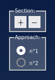
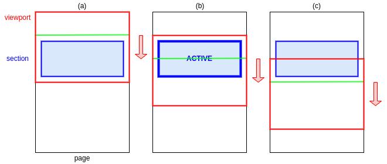
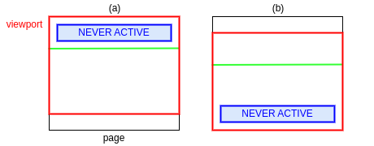
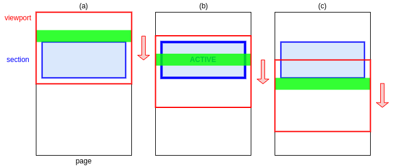
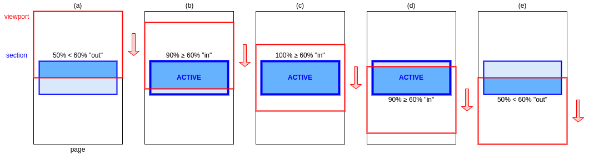
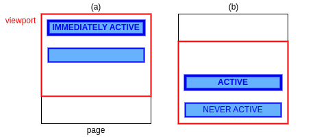
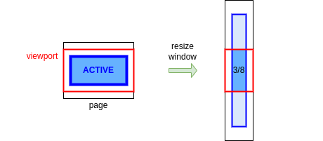

# Landing Page Project

This repository contains the code for Project 2 — [_Landing Page_](https://en.wikipedia.org/wiki/Landing_page) of the Udacity Nanodegree Front End Web Developer (2023).

**ⓘ Note:** This project is based on the starter project at https://github.com/udacity/cd0428-landing-page/. The instructions have been kept as-is in the section [Instructions](#instructions).

Content:

- [1. Instructions](#instructions)
- [2. Design notes](#design-notes)
  - [2.1. Highlight the active section](#active-section)
    - [2.1.1. Approach 1a — Scroll event and active line](#active-section-approach-1a)
    - [2.1.2. Approach 1b — Scroll event and active band](#active-section-approach-1b)
    - [2.1.3. Approach 2 — Intersection Observer API](#active-section-approach-2)
    - [2.1.4. Comparison of approaches](#active-section-comparison-of-approaches)
  - [2.2. Back-to-top button](#back-to-top-button)
    - [2.2.1. Approach 1 — Scroll event](#back-to-top-button-approach-1)
    - [2.2.2. Approach 2 — Intersection Observer API and dummy element](#back-to-top-button-approach-2)
    - [2.2.3. Comparison of approaches](#back-to-top-button-comparison-of-approaches)
    - [2.2.4. References](#back-to-top-button-references)
  - [2.3. Collapsible sections](#collapsible-sections)
  - [2.4 Auto-hiding scrollbar](#auto-hiding-scrollbar)
- [3. Sources and assets](#sources-and-assets)
- [4. Additional references](#additional-references)
- [5. Tools used](#tools-used)

<a id="instructions"></a>

## 1. Instructions

The starter project has some HTML and CSS styling to display a static version of the Landing Page project. You'll need to convert this project from a static project to an interactive one. This will require modifying the HTML and CSS files, but primarily the JavaScript file.

To get started, open `js/app.js` and start building out the app's functionality.

For specific, detailed instructions, look at the project instructions in the Udacity Classroom.

<a id="design-notes"></a>

## 2. Design notes

<a id="active-section"></a>

### 2.1. Highlight the active section

To highlight the active section (section in view), we would like to meet the following requirement(s):

- **R1:** By scrolling continuously from top to bottom, each section must be considered active _exactly once_. In other words, no section should be omitted (e.g., because it is the first one or the last one), or skipped over.

We explored 2 different approaches in this project. We added a little settings widget along the right edge of the viewport; it allows to append/remove sections (minimum 1, maximum 16) and to switch the approach (n°1 = approach 1b or n°2 = approach 2).



<a id="active-section-approach-1a"></a>

#### 2.1.1. Approach 1a — Scroll event and active line

##### Description

This is the approach suggested in the Development Strategy.

In this approach, we define an "active (horizontal) line" in the viewport. As the user scrolls down (or up), the section that straddles that line (if any) is considered active. The line can be described by the distance $d$ from viewport-top to the line. We can use absolute values (e.g., 100px) or relative values (e.g., 20% of viewport-height) for $d$.

In the following diagram, the page is represented by the tall black rectangle, the viewport by the red rectangle, and the sections by blue boxes. The "active line" is represented by the green horizontal line. In this scenario, the user is scrolling down. In case (b), the section straddles the "active line" and is thus considered active.



##### Edge cases

As the following edge cases show, Approach 1a requires a little bit of help from the design in order to work in call cases. Case (a): There should be enough space at the top of the page, so that the first section is located below the active line when the page is scrolled all the way to the top. Case (b): There should be enough space at the bottom of the page, so that the last section is located above the active line when the page is scrolled all the way to the bottom.



<a id="active-section-approach-1b"></a>

#### 2.1.2. Approach 1b — Scroll event and active band

##### Description

In this approach, instead of a line, we define an "active (horizontal) band" in the viewport. As the user scrolls down (or up), the section that straddles that band (if any) is considered active. The band can be described by the distance $d$ from viewport-top to band-top, and the width $w$ of the band. We can use absolute values (e.g., 100px), relative values (e.g., 20% of viewport-height), or a mixture of both.

Compared to the line, the band provides a little "pause" between 2 active sections when scrolling (assuming that there is no space between consecutive sections).

In the following diagram, we use the same conventions as above for the page, the viewport, and the sections. The "active band" is represented by the green horizontal band. In this scenario, the user is scrolling down. In case (b), the section straddles the "active band" and is thus considered active.



##### Edge cases

The 2 edge cases described above for the active line also apply here.

There is one more case we need to take care of: if we want all sections to be active at some point, the width $w$ of the band should not exceed the height of the shortest section. Here, since the CSS property `min-height: 40vh;` applies to all sections, we have a lower bound on the height of the shortest section. We can then use `window.innerHeight` as an approximation for `vh`, and make sure that $w$ is less than or equal to `0.4 * window.innerHeight`.

<a id="active-section-approach-2"></a>

#### 2.1.3. Approach 2 — Intersection Observer API

##### Description

Since 2019, Chrome, Firefox and Safari all support the [Intersection Observer API](https://developer.mozilla.org/en-US/docs/Web/API/Intersection_Observer_API).

In this approach, we use an observer to monitor the intersection(s) between the sections and the viewport. The observer takes a threshold $0 \leq t \leq 1$. For any given section, we can look at the "visible fraction" $f$ of that section i.e., the fraction of that section visible in the viewport. If $f \geq t$, the section is "in"; otherwise, $f < t$ and the section is "out". Whenever the status of one or more sections changes, the browser executes a callback, provided with the list of those sections impacted. That way, we can easily keep track of the state of all sections in the page. Finally, we define _the_ active section as the first section that is "in" (if any).

In the following diagram, we use the same conventions as above for the page, the viewport, and the sections. The part of a section that is visible in the viewport is colored using a darker shared of blue. In this example, we assume that $t = 60\%$.



##### Edge cases

As the following edge cases show, Approach 2 also requires a little bit of help from the design in order to work in all cases. Case (a): If we do not want the first section to be immediately active, there should be enough space at the top of the page, so that the visible fraction of the first section is initially ${} < t$. Case (b): If we want the last section to be active at some point, there should be enough space at the bottom of the page, so that the last section is the _only_ section with a visible fraction ${} \geq t$ at some point.



There is one more case we need to take care of: if the user reduces the width of the browser window to the minimum allowed, the reflow may increase the height of a section to the point that the visible fraction of that section can _no longer_ reach $t$. Case (a): In the original configuration, the visible fraction of the section can reach 100%. Case (b): the visible fraction of that same section cannot exceed 3/8.



We use the following approach to prevent this. On page load (`DOMContentLoaded` event), we compute the maximum visible fraction of each section and use the minimum of those values as the initial threshold $t$. Then, on resize (`resize` event), we re-compute the threshold $t$ (and re-create the observer).

<a id="active-section-comparison-of-approaches"></a>

#### 2.1.4. Comparison of approaches

Approach 1:

- Implementation: simple to implement.
- Need to handle: `scroll` event.
- Book-keeping: none required.
- Performance: good. Could easily scale to 100+ sections without the user noticing.

Approach 2:

- Implementation: more complicated to implement.
- Need to handle: observer callback and `resize` event (usually a much more rare occurrence than the `scroll` event).
- Book-keeping: some required (e.g., which sections are "in").
- Performance: good. Should outperform approach 1, since all visibility computations are "pushed" to the browser, and our code is called only when needed. Could in theory scale to an arbitrary number of sections.

If we had to choose, we would use Approach 1 for its combination of simplicity and good performance. A Landing Page, by its very nature, is probably unlikely to have more than 20 sections.

<a id="back-to-top-button"></a>

### 2.2. Back-to-top button

We also explored 2 different approaches to detect when the user has scrolled down sufficiently. Since those approaches use mechanisms similar to the ones used to highlight the active section, we did not add an additional widget. For the styling part, we were inspired by a few online resources, see the [References](#back-to-top-button-references) below.

<a id="back-to-top-button-approach-1"></a>

#### 2.2.1. Approach 1 — Scroll event

##### Description

In this approach, we handle the `scroll` event. Whenever we have scrolled down enough, we make the button appear. The listener uses the following test to decide if we are below the page fold:

```js
const isBelowFold = window.scrollY >= PAGE_FOLD_VH_FRACTION * window.innerHeight;
```

**ⓘ Note:**

- The `PAGE_FOLD_VH_FRACTION` should between 0 and 1. A value of 0 will make the button appear immediately without scrolling down. A value of 1 will make the button appear after scrolling down by the height of the viewport.

<a id="back-to-top-button-approach-2"></a>

#### 2.2.2. Approach 2 — Intersection Observer API and dummy element

##### Description

In this approach, we add a dummy `<div>` as the first child of `<body>`. That `<div>` is invisible, has a height of `100vh` and does not impact the normal flow thanks to `position: absolute`. Whenever the visible fraction of that `<div>` is less than a certain threshold, we make the button appear. The observer uses the following threshold:

```js
const options = {
  threshold: PAGE_FOLD_VH_FRACTION,
};
```

**ⓘ Note:**

- See the note for `PAGE_FOLD_VH_FRACTION` in approach 1 above.
- For convenience, we added the `<div>` directly to _index.html_ and the styles directly to _styles.css_, but the `<div>` could of course also be built and styled programmatically.

<a id="back-to-top-button-comparison-of-approaches"></a>

#### 2.2.3. Comparison of approaches

Approach 1:

- Implementation: simple to implement.
- Need to handle: `scroll` event.
- Book-keeping: none required.
- Performance: good.

Approach 2:

- Implementation: more complicated to implement. Requires adding a dummy element (the target of the observer).
- Need to handle: observer callback.
- Book-keeping: none required.
- Performance: good. Should outperform approach 1, since all visibility computations are "pushed" to the browser, and our code is called only when needed.

If we had to choose, we would use Approach 1 for its combination of simplicity and good performance.

<a id="back-to-top-button-references"></a>

#### 2.2.4. References

We were inspired by:

- [How To - Scroll Back To Top Button Semantic HTML](https://www.w3schools.com/howto/howto_js_scroll_to_top.asp) ([W3Schools](https://www.w3schools.com/))

<a id="collapsible-sections"></a>

### 2.3. Design notes — Collapsible sections

#### Description

We basically use a button and some JavaScript to update the `max-height` property of the content. As a built-in DOM element, the button provides good accessibility, and we add some `aria-...` attributes to improve the accessibility of the whole setup. We were inspired by a few online resources, see the [References](#collapsible-sections-references) below.

While looking for existing options, we found and decided not to use the following options:

- [`<details>`: The Details disclosure element](https://developer.mozilla.org/en-US/docs/Web/HTML/Element/details).
  **Reason for not using:** Putting aside the fact that the goal of this project is to manipulate the DOM with JavaScript, we were not sure if the semantic of the `<details>` element is appropriate in the context of a Landing Page. After all, the content of the sections is not a detail, it is the most important part.
- There are also many blogs posts, etc. demonstrating how to implement a collapsible using only CSS.
  **Reason for not using:** Again, putting aside the fact that the goal of this project is to manipulate the DOM with JavaScript, those solutions are actually rather involved and/or rely on very specific behavior of DOM elements (e.g., the fact that clicking on the label attached to a checkbox can be used to check/uncheck the box). Another concern was accessibility.

🔧 What could be improved:

- When collapsed, the section should show a preview of the content (e.g., the first 100 characters).
- Replacing `max-height: 100%;` by the computed height (in `px`) of the content would make it possible to have an animation when collapsing/expanding a section. This would force us to handle the `resize` event, though. Otherwise, if the user reduces the width of the browser window while the section is expanded, the reflow may increase the height of the content to the points that it overflows.

<a id="collapsible-sections-references"></a>

#### References

We were inspired by the following sources:

- [How To - Collapse](https://www.w3schools.com/howto/howto_js_collapsible.asp) ([W3Schools](https://www.w3schools.com/))
- [Technique: Expandable sections](https://accessibility.huit.harvard.edu/technique-expandable-sections) ([Digital Accessibility](https://accessibility.huit.harvard.edu/) website of Harvard University)

<a id="auto-hiding-scrollbar"></a>

### 2.4. Design notes — Auto-hiding scrollbar

#### Description

We initially add the classes `scrollable-content` and `scrollable-content--active` to the `<html>` element. As soon as the user moves the mouse and/or scrolls, we schedule a callback to remove the `scrollable-content--active` class. If the user scrolls and/or move, we cancel the current callback and schedule a new one.

🔧 What could be improved:

- When the scrollbar disappears, the content "jolts" to the right, which is not very pleasant. Reference 3. below describes the problem and suggests a few remedies. We tried the `scrollbar-gutter` CSS property but the result was not pleasant aesthetically due to the colored background. We did not try the other options.

#### References

We were inspired by the following sources:

1. [Using CSS to hide scrollbars without impacting scrolling](https://blog.logrocket.com/hide-scrollbar-without-impacting-scrolling-css/) ([LogRocket Blog](https://blog.logrocket.com/), Fimber Elemuwa, October 2023)
2. [The Current State of Styling Scrollbars in CSS (2022 Update)](https://css-tricks.com/the-current-state-of-styling-scrollbars-in-css/) ([CSS-Tricks](https://css-tricks.com/),
   Chris Coyier, February 2022)
3. [Preventing the Layout Shift Caused by Scrollbars](https://dev.to/rashidshamloo/preventing-the-layout-shift-caused-by-scrollbars-2flp) ([DEV Community](https://dev.to/), Rashid Shamloo, August 2023)

<a id="sources-and-assets"></a>

## 3. Sources and assets

We did not add additional assets to the starter project.

<a id="additional-references"></a>

## 4. Additional references

See the Design Notes above.

<a id="tools-used"></a>

## 5. Tools used

- [Visual Studio Code](https://code.visualstudio.com/).
  Use: IDE.
  **Extensions:**

  - [ESLint](https://marketplace.visualstudio.com/items?itemName=dbaeumer.vscode-eslint)
    Use: Linter for JavaSCript.

  - [Prettier](https://marketplace.visualstudio.com/items?itemName=esbenp.prettier-vscode)
    Use: Linter/formatter for JavaScript, HTML and CSS files.

  - [Stylelint](https://marketplace.visualstudio.com/items?itemName=stylelint.vscode-stylelint)
    Use: Linter for CSS files.
    **Plugins:**

    - [stylelint-config-idiomatic-order ](https://github.com/ream88/stylelint-config-idiomatic-order)
      Use: Automatically reorder CSS properties according to [Principles of writing consistent, idiomatic CSS](https://github.com/necolas/idiomatic-css#declaration-order).

- Chrome extensions:

  - [axe DevTools - Web Accessibility Testing](https://chrome.google.com/webstore/detail/axe-devtools-web-accessib/lhdoppojpmngadmnindnejefpokejbdd)
    Use: Web Accessibility Testing

- Online tools:

  - [Lorem Ipsum Generator](https://www.lipsum.com/feed/html)
    Use: Generate mock text content

  - [PX to REM Converter](https://codebeautify.org/px-to-rem-converter)
    Use: Convert between `px`, `rem` and `em`.

**ⓘ Note:** Visual Studio Code come with language support for JavaScript and TypeScript. We put `// @ts-check` at the top of all JavaScript files to benefit from the power of the TypeScript compiler. See [_JS Projects Utilizing TypeScript_](https://www.typescriptlang.org/docs/handbook/intro-to-js-ts.html).

### How to run Stylelint with plugins

There is an official VS Code [Stylelint extension](https://marketplace.visualstudio.com/items?itemName=stylelint.vscode-stylelint), but we did not figure out how to install plugins.

We managed to get a working setup using the VS Code [Dev Containers extension](https://marketplace.visualstudio.com/items?itemName=ms-vscode-remote.remote-containers):

1. Install Docker and make it possible to manage it as non-root.
2. Create _.devcontainer.json_:

   ```json
   {
     "image": "mcr.microsoft.com/devcontainers/javascript-node:20"
   }
   ```

3. Use the Command Palette: `Dev Containers: Reopen in Container`.
4. Open a terminal inside the container.
5. Install Stylelint and the plugin:

   ```bash
   npm init
   # ... omitted ...

   npm init stylelint
   # ... omitted ...

   npm install --save-dev stylelint-config-idiomatic-order
   # ... omitted ...
   ```

6. Create _.stylelintrc.json_:

   ```json
   {
     "extends": ["stylelint-config-idiomatic-order"]
   }
   ```

7. Run:

   ```bash
   # Report violations:
   npx stylelint "./css/*.css"

   # Fix violations:
   npx stylelint --fix "./css/*.css"
   ```

**ⓘ Note:** StyleLint does not understand [BEM](https://bem.info/) out⁻of-the-box. We added the following comment near the top in _styles.css_:

```css
/* stylelint-disable selector-class-pattern, selector-id-pattern */
```

It looks like there is a [stylelint-selector-bem-pattern](https://github.com/simonsmith/stylelint-selector-bem-pattern) plugin but we did not try it.
